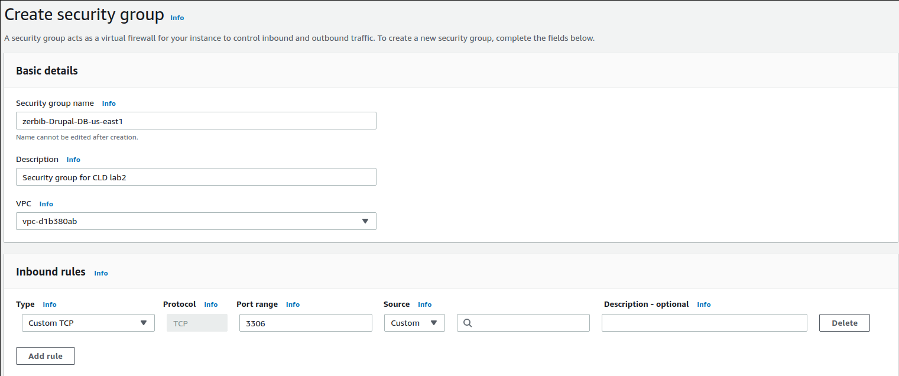
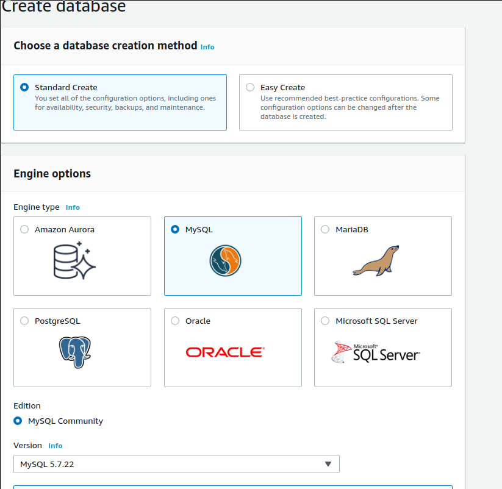
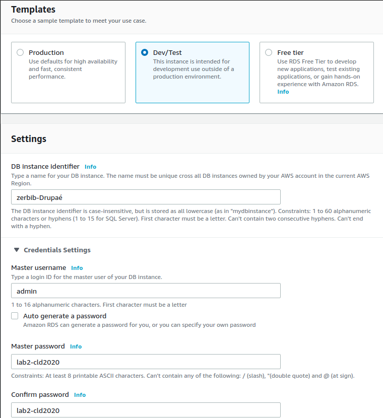
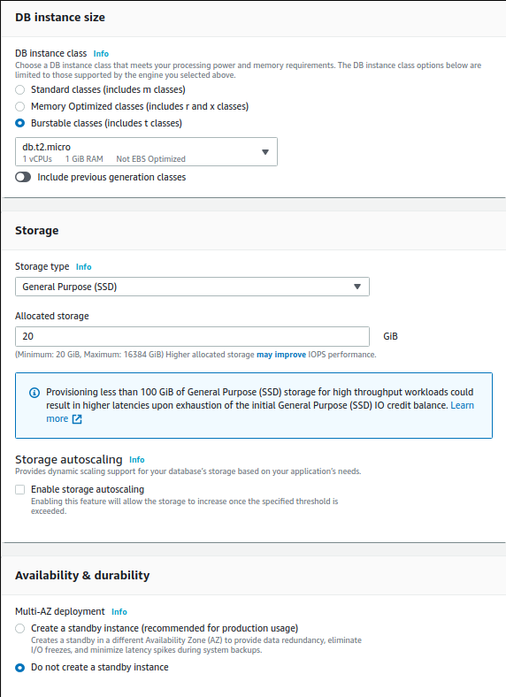
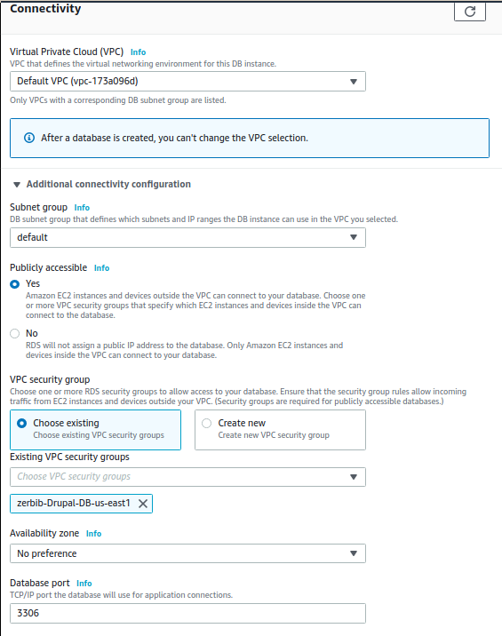
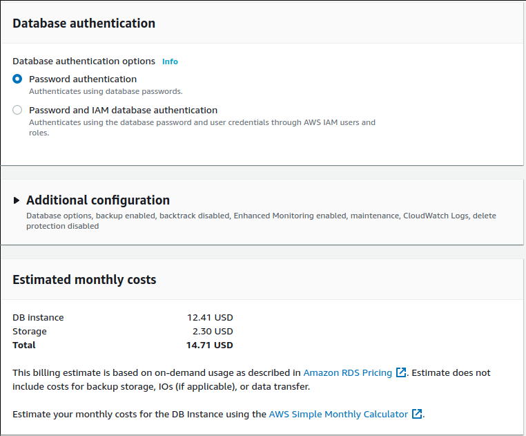
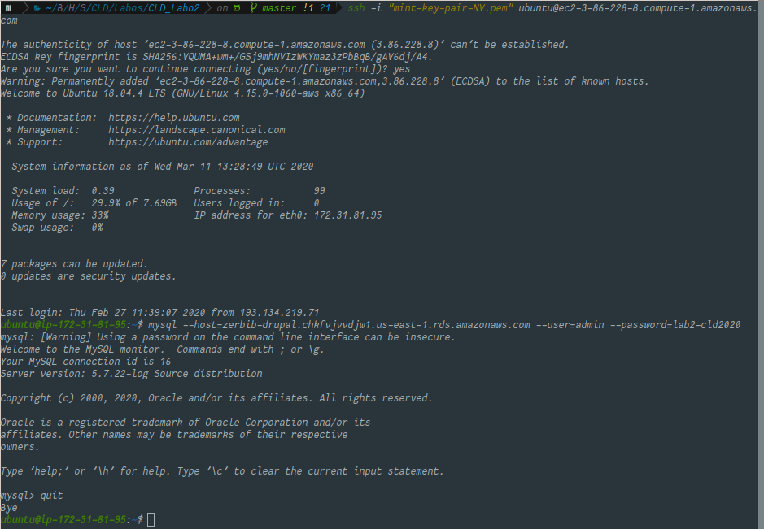
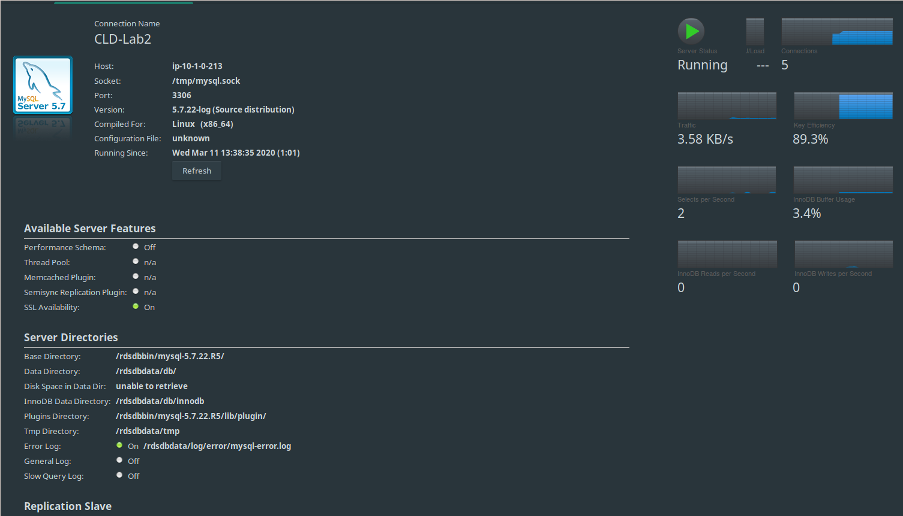

## LAB 02: APP SCALING ON AMAZON WEB SERVICES

## Auteurs : Jeremy Zerbib, Samuel Mettler

## Date : March 19, 2020

### TASK 1: CREATE A DATABASE USING THE RELATIONAL DATABASE SERVICE (RDS)

1. In the EC2 console create a *Security Group* with a name of the form *yourlastname*-Drupal-DB-us-east1 and open the TCP port on 3306 (MySQL default port).

   

2. Open the RDS console. Make sure to create the database in the same region as the Drupal master instance, switch the console to the region in which you created the Drupal master instance if it is not done.

3. Launch a DB instance: Click **Create database** and provide the following answers (leave any field not mentioned at its default value):

   - Choose a database creation method

     - Select **Standard Create**

   - Engine options

     - Engine type: **MySQL**

     - Edition: **MySQL Community**

     - Version: **MySQL 5.7.22**

       

   - Templates

     - Select **Dev/Test - MySQL**

   - Settings

     - DB Instance Identifier: **yourlastname-Drupal**

     - Master username: **admin**

     - Master Password: Invent a password and write it down (**lab2-cld2020**)

       

   - DB instance size

     - DB instance class
       - Select **Burstable classes**
       - Select **db.t2.micro**

   - Storage

     - Storage type: **General Purpose (SSD)**
     - Allocated Storage: **20 GB**
     - Storage Autoscalling:
       - Enable storage autoscaling: **unchecked**

   - Availability & durability

     - Multi-AZ deployment

       - **Do not create a standby instance**

         

   - Connectivity

     - Virtual Private Cloud (VPC)

       - Choose **Default VPC**

       - Additional connectivity configuration

         - Subnet group : **default**
         - Publicly accessible : **Yes**
         - VPC security group
           - Select **Choose existing**
           - Remove **default**
           - Add **yourname-Drupal-DB**

       - Leave the rest as it is

         

   - Database authentication

     - Database authentication options
       - Check **Password authentication**

   - Write down the estimated monthly costs that are displayed.

     

   **The estimated monthly cost is 14.71$.** 

   After launching the DB instance return to the instances view and wait for the DB instance to be created.

   4. In the RDS console select the newly created DB instance and write down the **Endpoint** address.

      The Endpoint address is : **zerbib-drupal.chkfvjvvdjw1.us-east-1.rds.amazonaws.com**

   5. Test whether the database can be reached from the Drupal master instance.

      - Log into the Drupal master instance.

      - Using the database's endpoint address (**without** the port number) and the master password you wrote down run the command:

        ```
        mysql --host=endpoint_address --user=<rds_master_username> --password=<rds_master_password>
        ```

        You should see a welcome message and the MySQL command line prompt `mysql>`. Type `quit` to exit.

        

   6. **Optional**: On your local machine download and install the **MySQLWorkbench** administration tool from http://www.mysql.com/products/workbench/ and use it to connect to the database.

      

      #### Livrables

      - **Copy the estimated costs you calculated and add it to the report**

      The estimated costs are up to 14.71$.

      - **Compare the costs of your RDS instance to a continuously running EC2 instance of the same size using the AWS calculator. (Don't forget to uncheck the ** Free Usage Tier **checkbox at the top.)**

      - **Copy the endpoint address of the database into the report.**

        The endpoint name is : **zerbib-drupal.chkfvjvvdjw1.us-east-1.rds.amazonaws.com**

      ### TASK 2: CONFIGURE THE DRUPAL MASTER INSTANCE TO USE THE RDS DATABASE

      #### CHANGE DRUPAL'S DATABASE CONFIGURATION

      1. Log into the Drupal master instance.

      2. Stop the web server by typing:

         ```
         sudo systemctl stop apache2
         ```

      3. To change Drupal's configuration parameters to point to the RDS database you will need to change the current configuration. At the end of the file **settings.php** found in the drupal folder (`/var/www/html/drupal/sites/default/`), you will find the current lines :

         ```
         $databases['default']['default'] = array (
           'database' => '<database_name>',
           'username' => '<username>',
           'password' => '<password>',
           'prefix' => '',
           'host' => 'localhost',
           'port' => '3306',
           'namespace' => 'Drupal\\Core\\Database\\Driver\\mysql',
           'driver' => 'mysql',
         );
         ```

         Change it to :

         ```
         $databases['default']['default'] = array (
           'database' => '<rds_db_name>',
           'username' => '<rds_master_username>',
           'password' => '<rds_master_password>',
           'prefix' => '',
           'host' => '<ip_address_of_rds_database>',
           'port' => '3306',
           'namespace' => 'Drupal\\Core\\Database\\Driver\\mysql',
           'driver' => 'mysql',
         );
         ```

      4. To make the authentication in the RDS database less strict connect to the database, create an additional user `''@'%'` and give this user access rights to the `` database.

         Perform the following steps:

         - Launch the `mysql` command to connect to the RDS database (it's the same command as the verification step after creating the RDS database):

         ```
         mysql --host=endpoint_address --user=<rds_master_username> --password=<rds_master_password>
         ```

         You should see a welcome message and the MySQL command line prompt `mysql>`.

      5. On the `mysql>` command prompt run the following three commands where `` is the database password for user `` you wrote down earlier:

         ```
         CREATE USER '<rds_username>'@'%' IDENTIFIED BY '<rds_password>';
         GRANT SELECT, INSERT, UPDATE, DELETE, CREATE, DROP, INDEX, ALTER, CREATE TEMPORARY TABLES, LOCK TABLES ON <rds_db_name>.* TO '<rds_username>'@'%' IDENTIFIED BY '<rds_password>';
         FLUSH PRIVILEGES;
         ```

      6. Disconnect from the RDS database by typing `quit` and verify that user `` can connect to the database by typing

         ```
         mysql --host=endpoint_address --user=<rds_username> --password=<rds_password>
         ```

      #### Migrate the database content to RDS

      To migrate the data currently stored in the MySQL database of the Drupal master instance into the RDS database, perform the following steps.

      1. Log into the Drupal master instance.

      2. Type the following command to migrate the database content from the local MySQL database to the RDS database.

         ```
         mysqldump --add-drop-table --user=<localhost_db_username> --password=<localhost_db_password> <localhost_database_name> |
           mysql --host=endpoint_address --user=<rds_username> --password=<rds_password> <rds_db_name>
         ```

         The command should complete without errors.

      3. Start the web server by typing:

         ```
         sudo systemctl start apache2
         ```

      4. Verify the database configuration by navigating with your browser to the Drupal home page at `http://hostname//`.

      #### DELIVERABLE 2

      - **Copy the part of settings.php that configures the database into the report.**

      