## LAB 02: APP SCALING ON AMAZON WEB SERVICES

## Authors : Jeremy Zerbib, Samuel Mettler

## Date : March 31, 2020

### TASK 1: CREATE A DATABASE USING THE RELATIONAL DATABASE SERVICE (RDS)

1. In the EC2 console create a *Security Group* with a name of the form *yourlastname*-Drupal-DB-us-east1 and open the TCP port on 3306 (MySQL default port).

   

2. Open the RDS console. Make sure to create the database in the same region as the Drupal master instance, switch the console to the region in which you created the Drupal master instance if it is not done.

3. Launch a DB instance: Click **Create database** and provide the following answers (leave any field not mentioned at its default value):

   - Choose a database creation method

     - Select **Standard Create**

   - Engine options

     - Engine type: **MySQL**

     - Edition: **MySQL Community**

     - Version: **MySQL 5.7.22**

       

   - Templates

     - Select **Dev/Test - MySQL**

   - Settings

     - DB Instance Identifier: **yourlastname-Drupal**

     - Master username: **admin**

     - Master Password: Invent a password and write it down (**lab2-cld2020**)

       
   
       **There's been a typo in the Identifier field in the screenshot above but it has been corrected in the lab**

   - DB instance size
   
     - DB instance class
    - Select **Burstable classes**
      
- Select **db.t2.micro**
       
   - Storage
   
     - Storage type: **General Purpose (SSD)**
     - Allocated Storage: **20 GB**
  - Storage Autoscalling:
  
- Enable storage autoscaling: **unchecked**
       
   - Availability & durability

     - Multi-AZ deployment

       - **Do not create a standby instance**

         

   - Connectivity

     - Virtual Private Cloud (VPC)

       - Choose **Default VPC**

       - Additional connectivity configuration
       
         - Subnet group : **default**
         - Publicly accessible : **Yes**
         - VPC security group
           - Select **Choose existing**
        - Remove **default**
       
     - Add **yourname-Drupal-DB**
       
     - Leave the rest as it is
       
         

   - Database authentication
   
  - Database authentication options
  
- Check **Password authentication**
       
   - Write down the estimated monthly costs that are displayed.

     

   **The estimated monthly cost is 14.71$.** 

   After launching the DB instance return to the instances view and wait for the DB instance to be created.

   4. In the RDS console select the newly created DB instance and write down the **Endpoint** address.

      The Endpoint address is : **zerbib-drupal.chkfvjvvdjw1.us-east-1.rds.amazonaws.com**

   5. Test whether the database can be reached from the Drupal master instance.

      - Log into the Drupal master instance.
- Using the database's endpoint address (**without** the port number) and the master password you wrote down run the command:

```bash
 mysql --host=endpoint_address --user=<rds_master_username> --password=<rds_master_password
```

You should see a welcome message and the MySQL command line prompt `mysql>`. Type `quit` to exit.     

   6. **Optional**: On your local machine download and install the **MySQLWorkbench** administration tool from http://www.mysql.com/products/workbench/ and use it to connect to the database.

      

#### Livrables

- **Copy the estimated costs you calculated and add it to the report**

The estimated monthly costs are up to 14.71$.

- **Compare the costs of your RDS instance to a continuously running EC2 instance of the same size using the AWS calculator. (Don't forget to uncheck the ** Free Usage Tier **checkbox at the top.)**

  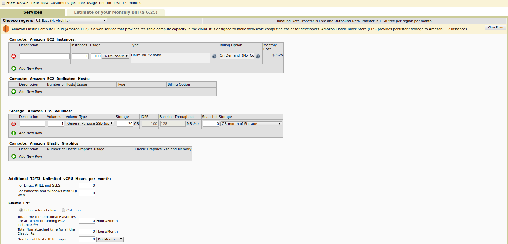

  We can see that for an *EC2 instance*, it will cost roughly 6.25$ for a monthly usage at 100%.

  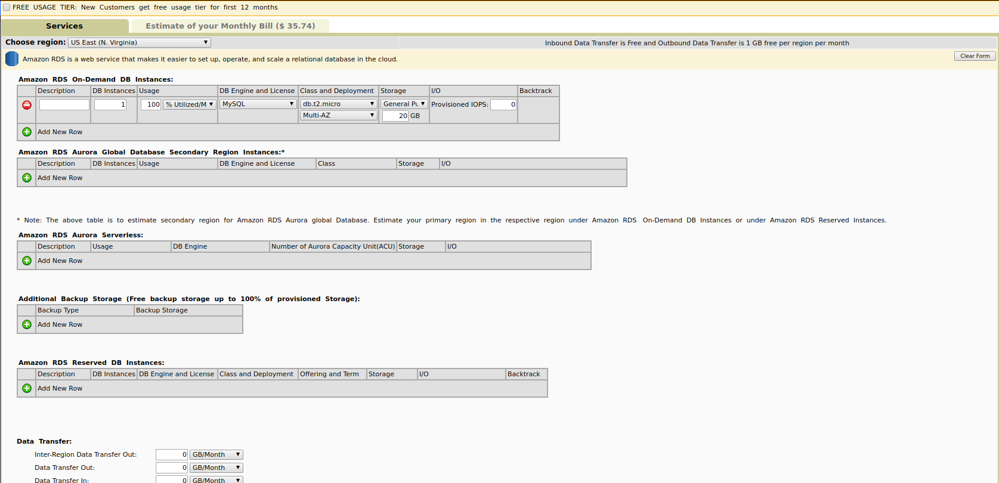

  We can see that the monthly costs for a *RDS instance* will costs roughly 35.74$ running at 100%.

- **In a two-tier architecture the web application and the database are kept separate and run on different hosts. Imagine that for the second tier instead of using RDS to store the data you would create a virtual machine in EC2 and install and run yourself a database on it. If you were the Head of IT of a medium-size business, how would you argue in favor of using a database as a service instead of running your own database on an EC2 instance? How would you argue against it?**

Running a *RDS instance* as a service instead of running our own database could be the best idea for the company as we need availability for our clients. If one instance is down, it does not mean that the other is also down. Also, using an RDS architecture is faster to execute queries on a DB, scales well, handles concurrency and larger datasets.  It is also easier to create relations between two tables.

On the other hand, on a cost basis, it would be wiser to run our own database on an EC2 instance. It is way cheaper to run an EC2 instance as stated above.

- **Copy the endpoint address of the database into the report.**
  
  The endpoint name is : **zerbib-drupal.chkfvjvvdjw1.us-east-1.rds.amazonaws.com**

#### Additional information

Credentials are not well formed as we took this lab as an exercise. They need to be more secured than those ones.

| Username | Password     |
| -------- | ------------ |
| admin    | lab2-cld2020 |

### TASK 2: CONFIGURE THE DRUPAL MASTER INSTANCE TO USE THE RDS DATABASE

In this task you will migrate the content of the local MySQL database to the newly created RDS database and change Drupal's database configuration to use the RDS database.

#### CHANGE DRUPAL'S DATABASE CONFIGURATION

1. Log into the Drupal master instance.

2. Stop the web server by typing:

   ```bash
   sudo systemctl stop apache2
   ```
   
   3. To change Drupal's configuration parameters to point to the RDS database you will need to change the current configuration. At the end of the file **settings.php** found in the drupal folder (`/var/www/html/drupal/sites/default/`), you will find the current lines :


   ```mysql
$databases['default']['default'] = array (
    'database' => '<database_name>',
    'username' => '<username>',
    'password' => '<password>',
    'prefix' => '',
    'host' => 'localhost',
    'port' => '3306',
    'namespace' => 'Drupal\\Core\\Database\\Driver\\mysql',
    'driver' => 'mysql',
);
   ```

Change it to :

```mysql
$databases['default']['default'] = array (
    'database' => '<rds_db_name>',
    'username' => '<rds_master_username>',
    'password' => '<rds_master_password>',
    'prefix' => '',
    'host' => '<ip_address_of_rds_database>',
    'port' => '3306',
    'namespace' => 'Drupal\\Core\\Database\\Driver\\mysql',
    'driver' => 'mysql',
);
```

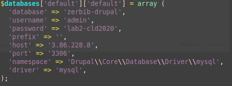

4. To make the authentication in the RDS database less strict connect to the database, create an additional user `'<rds_username>'@'%'` and give this user access rights to the `<rds_db_name>` database.
     Perform the following steps:
     - Launch the `mysql` command to connect to the RDS database (it's the same command as the verification step after creating the RDS database):

   ```bash
mysql --host=endpoint_address --user=<rds_master_username> --password=<rds_master_password>
   ```

You should see a welcome message and the MySQL command line prompt `mysql>`.

  5. On the `mysql>` command prompt run the following three commands where `<rds_password>` is the database password for user `<rds_username>` you wrote down earlier:

```mysql
CREATE USER '<rds_username>'@'%' IDENTIFIED BY '<rds_password>';
GRANT SELECT, INSERT, UPDATE, DELETE, CREATE, DROP, INDEX, ALTER, CREATE TEMPORARY TABLES, LOCK TABLES ON <rds_db_name>.* TO '<rds_username>'@'%' IDENTIFIED BY '<rds_password>';
FLUSH PRIVILEGES;
```

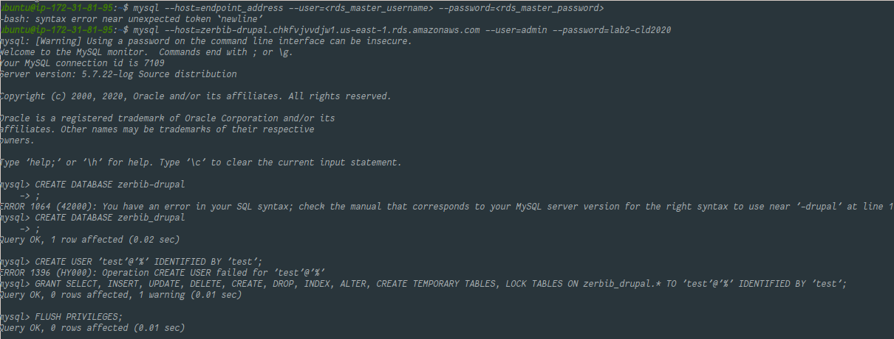

    6. Disconnect from the RDS database by typing `quit` and verify that user `<rds_username>` can connect to the database by typing

```bash
mysql --host=endpoint_address --user=<rds_username> --password=<rds_password>
```

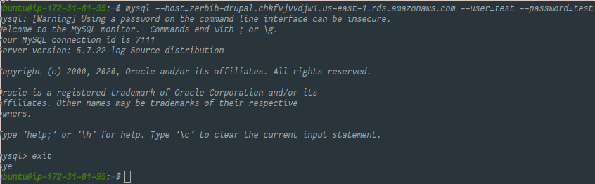

#### Migrate the database content to RDS

To migrate the data currently stored in the MySQL database of the Drupal master instance into the RDS database, perform the following steps.
      1. Log into the Drupal master instance.
      2. Type the following command to migrate the database content from the local MySQL database to the RDS database.

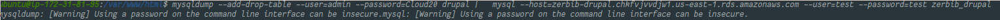

   ```bash
mysqldump --add-drop-table --user=<localhost_db_username> --password=<localhost_db_password> <localhost_database_name> | mysql --host=endpoint_address --user=<rds_username> --password=<rds_password> <rds_db_name>
   ```

The command should complete without errors.

  3. Start the web server by typing:
  
     ```bash
     sudo systemctl start apache2
     ```
  
  4. Verify the database configuration by navigating with your browser to the Drupal home page at `http://hostname/<database_name>/`.

  #### DELIVERABLE 2

  - **Copy the part of settings.php that configures the database into the report.**

```php
$databases['default']['default'] = array (
  'database' => 'zerbib_drupal',
  'username' = 'admin',
  'password' => 'lab2-cld2020',
  'prefix' => '',
  'host' => '3.84.43.137',
  'port' => '3306',
  'namespace' => 'Drupal\\Core\\Database\\Driver\\mysql',
  'driver' => 'mysql',
);
```

#### Additional information

As stated above, we did not well formed our credentials for this part. It needs to be more secured.

| Username | Password |
| -------- | -------- |
| test     | test     |

### TASK 3: CREATE A CUSTOM VIRTUAL MACHINE IMAGE

Now that you have properly configured the Drupal master instance, you will save it into a virtual machine image. This image will be used later to create new instances with the exact same configuration.

1. In the EC2 console bring up the **Instances** panel and select the Drupal master instance.

2. Bring up the context menu and select **Image > Create Image**. Provide the following answers (leave any field not mentioned at its default value):

   - Image Name: **yourlastname-Drupal**.
   - Image Description: **Drupal connected to RDS database**.

   Click **Create Image**. The instance will shut down temporarily and the image will be created.

3. In the console bring up the **AMIs** panel. Wait until the status of the AMI goes from **pending** to **available**.

#### DELIVERABLE 3:

- Copy a screenshot of the AWS console showing the AMI parameters into the report.

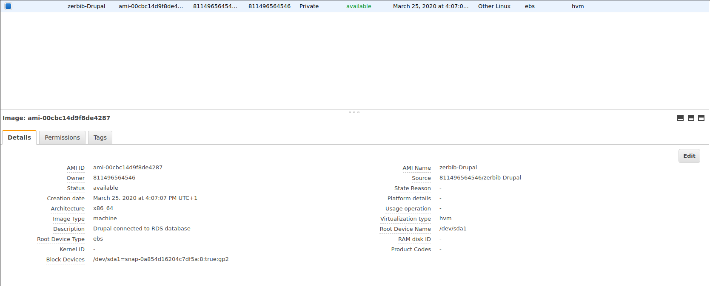

### TASK 4: CREATE A LOAD BALANCER

In this task you will create a load balancer in AWS that will receive the HTTP requests from clients and forward them to the Drupal instances.

1. Verifiy and note in which availability zone your instance is running.

2. In the EC2 console bring up the **Load Balancers** panel. Click on **Create Load Balancer**. Provide the following answers (leave any field not mentioned at its default value):

   - Choose : **Application Load Balancer**

   - Configure Load Balancer

     - Name: **yourlastname-loadBalancer**.
     - Scheme: **internet-facing**
     - IP address type: **ipv4**
     - Listeners
       - Make sure the protocol **HTTP** on port **80** is set, else set it.

     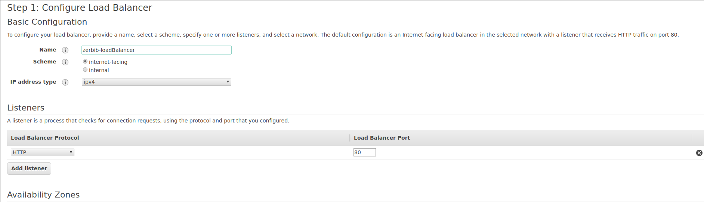

     - Availability Zones

       - Select 2 availability zones. Make sure that one of them corresponds to where your instance is running.

       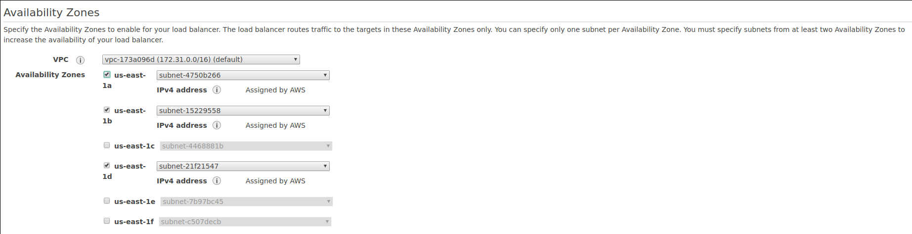

   - Configure Security Groups

     - Use the same security group as the Drupal instance.

     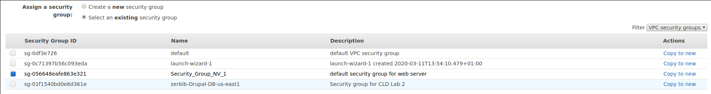

   - Configure Routing

     - Target Group : **New target group**
     - Name : **yourLastName-target-group**
     - Target Type: Instance
     - Advanced Health check settings
       - Healthy threshold : **2**
       - Interval : **10** seconds

     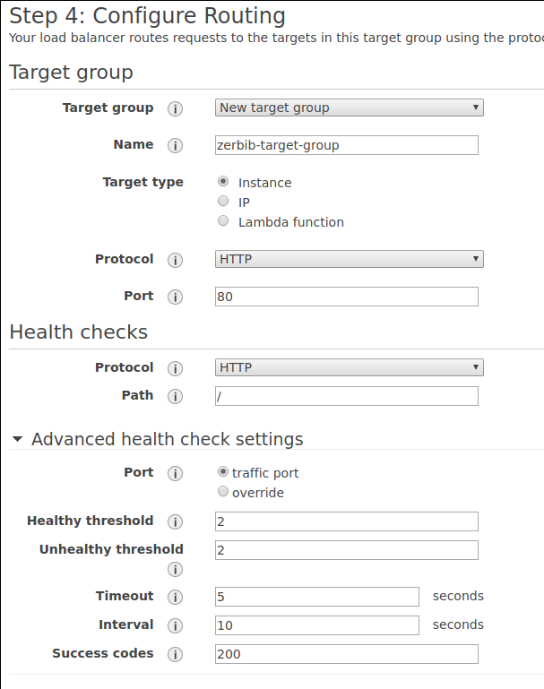

   - Register Targets

     - Select the instances and **Add to registered**

     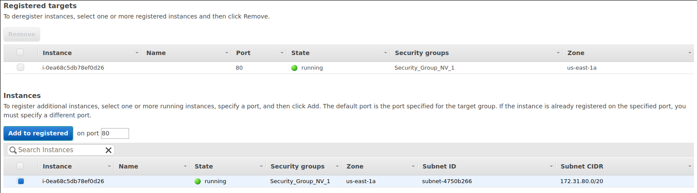

   - Review&Create

   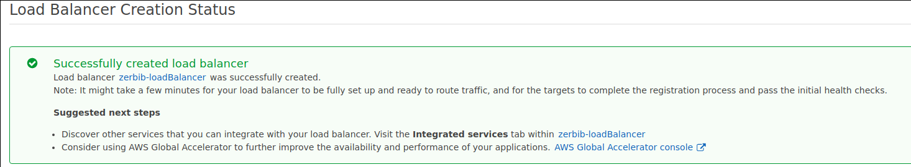

3. In the EC2 console select the newly created load balancer. Write down its **DNS Name** (A Record).

   The load balancer's DNS name is : `zerbib-loadBalancer-1551091547.us-east-1.elb.amazonaws.com`

4. In the EC2 console select the Target Group. In the lower half of the panel, click on the **Targets** tab. Watch the status of the instance go from **unused** to **initial**.

5. Log into the Drupal master instance. Examine the Apache access log **/var/log/apache2/access.log** to see who is connecting to the web server.

#### DELIVERABLE 4:

- On your local machine resolve the DNS name of the load balancer into an IP address using the nslookup command (Linux or Windows). Write the DNS name and the resolved IP Address(es) into the report.

  ```
  Server:		192.168.1.1
  Address:	192.168.1.1#53
  
  Non-authoritative answer:
  Name:	zerbib-loadBalancer-1551091547.us-east-1.elb.amazonaws.com
  Address: 54.164.250.69
  Name:	zerbib-loadBalancer-1551091547.us-east-1.elb.amazonaws.com
  Address: 52.1.94.21
  
  Authoritative answers can be found from:
  ```

- In the Apache access log identify the health check accesses from the load balancer and copy some samples into the report.

  ```
  172.31.83.54 - - [25/Mar/2020:15:39:11 +0000] "GET / HTTP/1.1" 200 3440 "-" "ELB-HealthChecker/2.0"
  172.31.83.54 - - [25/Mar/2020:15:39:21 +0000] "GET / HTTP/1.1" 200 3440 "-" "ELB-HealthChecker/2.0"
  172.31.23.181 - - [25/Mar/2020:15:39:25 +0000] "GET / HTTP/1.1" 200 3440 "-" "ELB-HealthChecker/2.0"
  172.31.83.54 - - [25/Mar/2020:15:39:31 +0000] "GET / HTTP/1.1" 200 3440 "-" "ELB-HealthChecker/2.0"
  172.31.23.181 - - [25/Mar/2020:15:39:35 +0000] "GET / HTTP/1.1" 200 3440 "-" "ELB-HealthChecker/2.0"
  172.31.83.54 - - [25/Mar/2020:15:39:41 +0000] "GET / HTTP/1.1" 200 3440 "-" "ELB-HealthChecker/2.0"
  172.31.23.181 - - [25/Mar/2020:15:39:45 +0000] "GET / HTTP/1.1" 200 3440 "-" "ELB-HealthChecker/2.0"
  172.31.83.54 - - [25/Mar/2020:15:39:51 +0000] "GET / HTTP/1.1" 200 3440 "-" "ELB-HealthChecker/2.0"
  172.31.23.181 - - [25/Mar/2020:15:39:55 +0000] "GET / HTTP/1.1" 200 3440 "-" "ELB-HealthChecker/2.0"
  172.31.83.54 - - [25/Mar/2020:15:40:01 +0000] "GET / HTTP/1.1" 200 3440 "-" "ELB-HealthChecker/2.0"
  172.31.23.181 - - [25/Mar/2020:15:40:05 +0000] "GET / HTTP/1.1" 200 3440 "-" "ELB-HealthChecker/2.0"
  172.31.83.54 - - [25/Mar/2020:15:40:11 +0000] "GET / HTTP/1.1" 200 3440 "-" "ELB-HealthChecker/2.0"
  172.31.23.181 - - [25/Mar/2020:15:40:15 +0000] "GET / HTTP/1.1" 200 3440 "-" "ELB-HealthChecker/2.0"
  172.31.83.54 - - [25/Mar/2020:15:40:21 +0000] "GET / HTTP/1.1" 200 3440 "-" "ELB-HealthChecker/2.0"
  172.31.23.181 - - [25/Mar/2020:15:40:25 +0000] "GET / HTTP/1.1" 200 3440 "-" "ELB-HealthChecker/2.0"
  172.31.83.54 - - [25/Mar/2020:15:40:31 +0000] "GET / HTTP/1.1" 200 3440 "-" "ELB-HealthChecker/2.0"
  172.31.23.181 - - [25/Mar/2020:15:40:35 +0000] "GET / HTTP/1.1" 200 3440 "-" "ELB-HealthChecker/2.0"
  172.31.83.54 - - [25/Mar/2020:15:40:41 +0000] "GET / HTTP/1.1" 200 3440 "-" "ELB-HealthChecker/2.0"
  172.31.23.181 - - [25/Mar/2020:15:40:45 +0000] "GET / HTTP/1.1" 200 3440 "-" "ELB-HealthChecker/2.0"
  172.31.83.54 - - [25/Mar/2020:15:40:51 +0000] "GET / HTTP/1.1" 200 3440 "-" "ELB-HealthChecker/2.0"
  172.31.23.181 - - [25/Mar/2020:15:40:55 +0000] "GET / HTTP/1.1" 200 3440 "-" "ELB-HealthChecker/2.0"
  172.31.83.54 - - [25/Mar/2020:15:41:01 +0000] "GET / HTTP/1.1" 200 3440 "-" "ELB-HealthChecker/2.0"
  172.31.23.181 - - [25/Mar/2020:15:41:05 +0000] "GET / HTTP/1.1" 200 3440 "-" "ELB-HealthChecker/2.0"
  172.31.83.54 - - [25/Mar/2020:15:41:11 +0000] "GET / HTTP/1.1" 200 3440 "-" "ELB-HealthChecker/2.0"
  172.31.23.181 - - [25/Mar/2020:15:41:15 +0000] "GET / HTTP/1.1" 200 3440 "-" "ELB-HealthChecker/2.0"
  172.31.83.54 - - [25/Mar/2020:15:41:21 +0000] "GET / HTTP/1.1" 200 3440 "-" "ELB-HealthChecker/2.0"
  172.31.23.181 - - [25/Mar/2020:15:41:25 +0000] "GET / HTTP/1.1" 200 3440 "-" "ELB-HealthChecker/2.0"
  172.31.83.54 - - [25/Mar/2020:15:41:31 +0000] "GET / HTTP/1.1" 200 3440 "-" "ELB-HealthChecker/2.0"
  172.31.23.181 - - [25/Mar/2020:15:41:35 +0000] "GET / HTTP/1.1" 200 3440 "-" "ELB-HealthChecker/2.0"
  172.31.83.54 - - [25/Mar/2020:15:41:41 +0000] "GET / HTTP/1.1" 200 3440 "-" "ELB-HealthChecker/2.0"
  172.31.23.181 - - [25/Mar/2020:15:41:45 +0000] "GET / HTTP/1.1" 200 3440 "-" "ELB-HealthChecker/2.0"
  172.31.83.54 - - [25/Mar/2020:15:41:51 +0000] "GET / HTTP/1.1" 200 3440 "-" "ELB-HealthChecker/2.0"
  172.31.23.181 - - [25/Mar/2020:15:41:55 +0000] "GET / HTTP/1.1" 200 3440 "-" "ELB-HealthChecker/2.0"
  172.31.83.54 - - [25/Mar/2020:15:42:01 +0000] "GET / HTTP/1.1" 200 3440 "-" "ELB-HealthChecker/2.0"
  172.31.23.181 - - [25/Mar/2020:15:42:05 +0000] "GET / HTTP/1.1" 200 3440 "-" "ELB-HealthChecker/2.0"
  172.31.83.54 - - [25/Mar/2020:15:42:11 +0000] "GET / HTTP/1.1" 200 3440 "-" "ELB-HealthChecker/2.0"
  172.31.23.181 - - [25/Mar/2020:15:42:15 +0000] "GET / HTTP/1.1" 200 3440 "-" "ELB-HealthChecker/2.0"
  172.31.83.54 - - [25/Mar/2020:15:42:21 +0000] "GET / HTTP/1.1" 200 3440 "-" "ELB-HealthChecker/2.0"
  172.31.23.181 - - [25/Mar/2020:15:42:25 +0000] "GET / HTTP/1.1" 200 3440 "-" "ELB-HealthChecker/2.0"
  172.31.83.54 - - [25/Mar/2020:15:42:31 +0000] "GET / HTTP/1.1" 200 3440 "-" "ELB-HealthChecker/2.0"
  172.31.23.181 - - [25/Mar/2020:15:42:35 +0000] "GET / HTTP/1.1" 200 3440 "-" "ELB-HealthChecker/2.0"
  172.31.83.54 - - [25/Mar/2020:15:42:41 +0000] "GET / HTTP/1.1" 200 3440 "-" "ELB-HealthChecker/2.0"
  172.31.23.181 - - [25/Mar/2020:15:42:45 +0000] "GET / HTTP/1.1" 200 3440 "-" "ELB-HealthChecker/2.0"
  172.31.83.54 - - [25/Mar/2020:15:42:51 +0000] "GET / HTTP/1.1" 200 3440 "-" "ELB-HealthChecker/2.0"
  172.31.23.181 - - [25/Mar/2020:15:42:55 +0000] "GET / HTTP/1.1" 200 3440 "-" "ELB-HealthChecker/2.0"
  172.31.83.54 - - [25/Mar/2020:15:43:01 +0000] "GET / HTTP/1.1" 200 3440 "-" "ELB-HealthChecker/2.0"
  ```

  We can see that only two IPs are accessing the Drupal instance, bouncing from one to the other. We can guess that the load balancer is working well and the round-robin algorithm is used.

### TASK 5: LAUNCH A SECOND INSTANCE FROM THE CUSTOM IMAGE

In this task you will launch a second Drupal instance and connect it to the load balancer.

1. Using the custom virtual machine image you created earlier launch a second instance.
2. Make sure that the instance works correctly by navigating with your browser to the Drupal home page of the new instance at `http://hostname/<database-name>/`.
3. Using the AWS console connect the instance to the load balancer. Watch the status of the instance go from **Out of Service** to **In Service**.

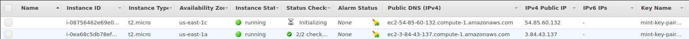

#### DELIVERABLE 5:

- Draw a diagram of the setup you have created showing the components (instances, database, load balancer, client) and how they are connected. Include the security groups as well.

  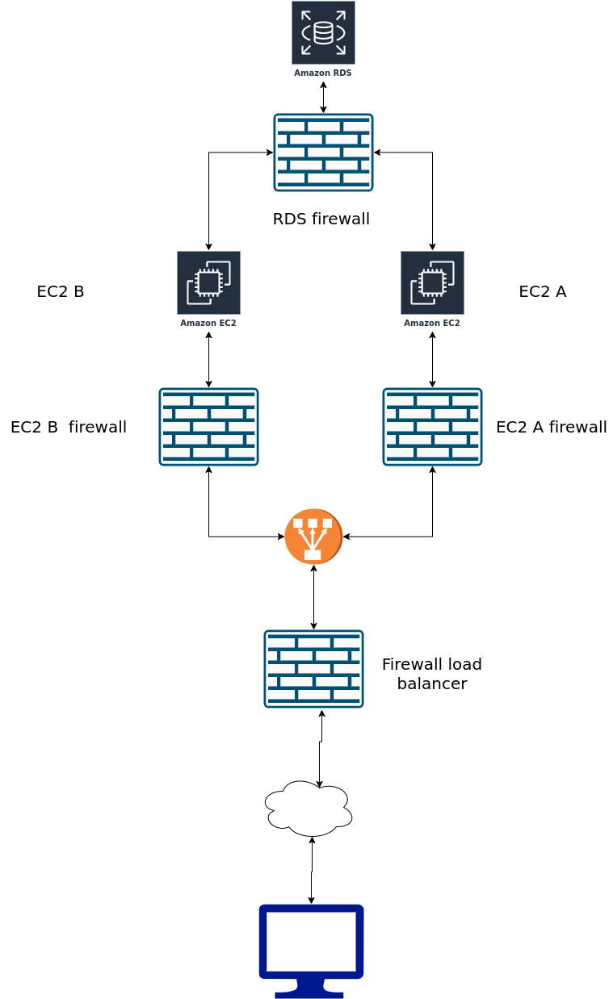

- Using the [Simple Monthly Calculator](http://calculator.s3.amazonaws.com/calc5.html) calculate the monthly cost of this setup. You can ignore traffic costs. (Make sure you don't forget to include a component in the calculation. Also don't forget to uncheck the **Free Usage Tier** checkbox at the top.)

  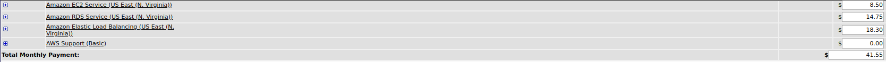

  The price for a month running this setup would be 41.55$.

### TASK 6: TEST THE DISTRIBUTED APPLICATION

In this task you will test the distributed application with a load generator and use the monitoring tools of the AWS console.

1. Download and install on your local machine the JMeter tool from http://jmeter.apache.org/.
2. Open two terminal windows side-by-side and, using SSH, log into each instance. Bring up a continuous display of the Apache access log by running the command **sudo tail -F /var/log/apache2/access.log**.
3. Using the AWS console, enable detailed (1-minute interval) monitoring of the two instances: Select an instance and click on the **Monitoring** tab. Click on **Enable Detailed Monitoring**.
4. Follow the instructions on http://fredpuls.com/site/softwaredevelopment/java/test/test_jmeter_quick_start.htm to create a simple test plan. Specify the load balancer as the target for the HTTP requests. Run a test.
5. Observe which of the instances gets the load. Increase the load and re-run the test. Observe response times and time-outs. Repeat until you see inacceptable response times and/or time-outs.
6. Immediately after having created a high load for the site, re-run the nslookup command to resolve the DNS name of the load balancer into IP addresses to see if there are any changes.

#### DELIVERABLE 6:

- Document your observations. Include screenshots of JMeter and the AWS console monitoring output.
- When you resolve the DNS name of the load balancer into IP addresses while the load balancer is under high load what do you see? Explain.
- Did this test really test the load balancing mechanism? What are the limitations of this simple test? What would be necessary to do realistic testing?

Note: In this task it is not important that you reproduce exactly an expected behavior of the load balancer. Your load generator (your local machine and your local network) may not behave always the same, the ELB may not always behave the same and you may get results different from your colleagues. **What is important however is that you show that you understand the distributed system that you are testing and that you know how to observe the performance of its components with the monitoring functions provided by AWS. You should show that you are able to correlate the performance with different loads generated by JMeter and draw conclusions.**

##### With 10 threads, 1 loop and a 0 second ramp-up period

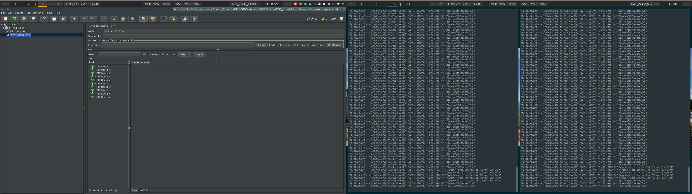

##### With 20 threads, 1 loop and a 0 second ramp-up period

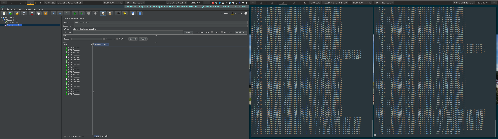

##### With 100 threads, 1 loop and a 0 second ramp-up period

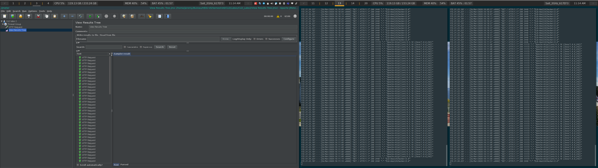

##### With 100'000 threads, 1 loop and a 0 second ramp-up period

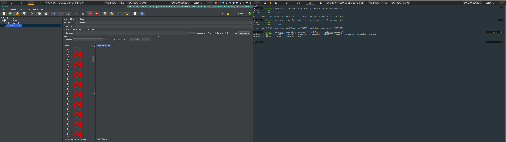

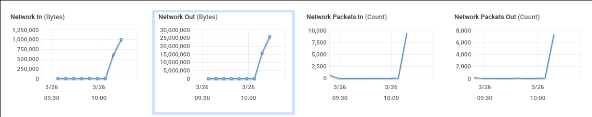

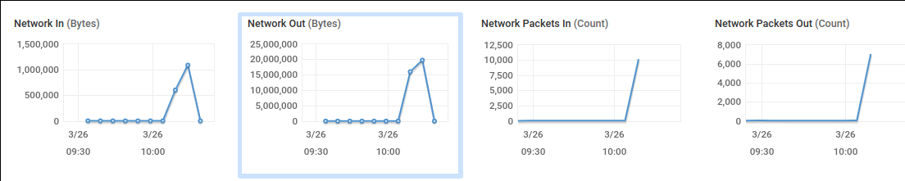

We can see that this time, the load-balancer is almost drowning in its own load. It looks like the load-balancer is not available and therefore it times out. It is due to the fact that it is overloaded with requests and it cannot accept anymore of them.

As far as the testing goes, we cannot say that we have tested the load balancing mechanism as  we did not define the rules of the balancing explicitly. We can guess that the default *Round-robin* worked but we cannot be sure as we do not have the same distribution on the network monitor above.